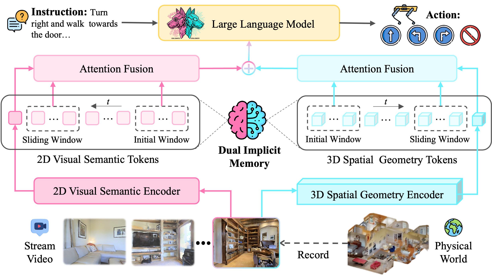
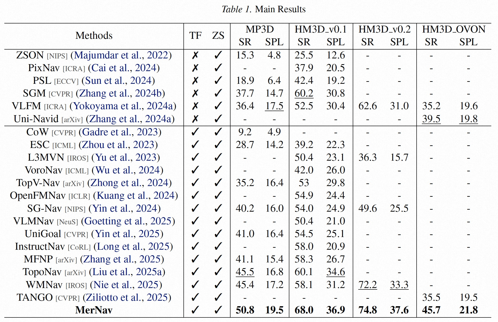
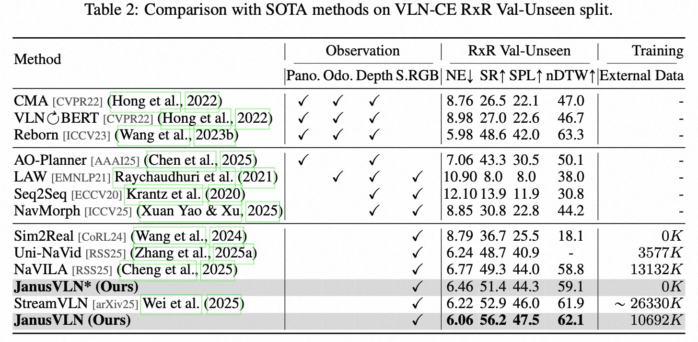

<!-- 顶部浮动demo图片 - 更新版本 -->

    

        
    

    

    

        

            <h1 class="hero-title">MerNav</h1>
            <!--
            

                

                
                

                    ✨
                    🌟
                    ⭐️
                

            

            -->
        

        
        <!-- Paper信息 - 紧凑布局 -->
        

            <h3 class="paper-title-main">
                MerNav: A Highly Generalizable Memory-Execute-Review Framework for Zero-Shot Object Goal Navigation
            </h3>
            <a href="https://arxiv.org/pdf/2602.05467" target="_blank" rel="noopener noreferrer">
                
📄 Research Paper

            </a>
        

        
        <!-- 作者信息 -->
        

            

                <a href="https://scholar.google.com/citations?user=fOU1xMAAAAAJ&hl=zh-CN&oi=ao">Dekang Qi</a>1,
                <a href="https://scholar.google.com/citations?user=91lbdPcAAAAJ&hl=zh-CN">Shuang Zeng</a>1,
                <a href="https://scholar.google.com/citations?user=5OnPBVYAAAAJ&hl=zh-CN&oi=ao">Xinyuan Chang</a>1,
                <a href="https://scholar.google.com/citations?hl=zh-CN&user=_X4MQ-gAAAAJ">Feng Xiong</a>1,
                <a>Shichao Xie</a>1,
                <a>Xiaolong Wu</a>1,
                <a>Mu Xu</a>1,
            

            

                1Amap, Alibaba Group,
                
            

        

        
        <!-- 论文链接 - 增强版 -->
        

            <a href="https://arxiv.org/abs/2602.05467" class="paper-link-fancy arxiv-link" target="_blank">
                
📚

                arXiv
                

            </a>
            <!--
            <a href="https://github.com/MIV-XJTU/JanusVLN" class="paper-link-fancy github-link" target="_blank">
                
💻

                GitHub
                

            </a>
            <a href="https://www.modelscope.cn/models/misstl/JanusVLN_Base" class="paper-link-fancy huggingface-link" target="_blank">
                
🤗

                Model (JanusVLN_Base)
                

            </a>
            <a href="https://www.modelscope.cn/models/misstl/JanusVLN_Extra" class="paper-link-fancy demo-link" target="_blank">
                
🚀

                Model (JanusVLN_Extra)
                

            </a>
            <a href="https://www.modelscope.cn/datasets/misstl/JanusVLN_Trajectory_Data" class="paper-link-fancy dataset-link" target="_blank">
                
📊

                Datasets
                

            </a>
            
            <a href="https://www.youtube.com/watch?v=U0IpLJOu48Y" class="paper-link-fancy video-link" target="_blank">
                
🎬

                Demo Video
                

            </a>
            -->
        

    

<!-- Abstract Section -->

    

        <h2 class="abstract-title">Abstract</h2>
        

            Visual Language Navigation (VLN) is one of the fundamental capabilities for embodied intelligence and a critical challenge that urgently needs to be addressed. However, existing methods are still unsatisfactory in terms of both success rate (SR) and generalization: Supervised Fine-Tuning (SFT) approaches typically achieve higher SR, while Training-Free (TF) approaches often generalize better, but it is difficult to obtain both simultaneously. To this end, we propose a Memory-Execute-Review framework. It consists of three parts: a hierarchical memory module for providing information support, an execute module for routine decision-making and actions, and a review module for handling abnormal situations and correcting behavior. We validated the effectiveness of this framework on the Object Goal Navigation task. Across 4 datasets, our average SR achieved absolute improvements of 7% and 5% compared to all baseline methods under TF and Zero-Shot (ZS) settings, respectively. On the most commonly used HM3D_v0.1 and the more challenging open vocabulary dataset HM3D_OVON, the SR improved by 8% and 6%, under ZS settings. Furthermore, on the MP3D and HM3D_OVON datasets, our method not only outperformed all TF methods but also surpassed all SFT methods, achieving comprehensive leadership in both SR (5% and 2%) and generalization.
        

    

<!-- Video Showcase Section -->

    

        

            <h2 class="video-title">Demo Video</h2>
        

            

            <iframe width="1000" height="600" src="https://www.youtube.com/embed/SfrkZks_XE8?si=lWiV3Cv8Pkf8l6PN" title="YouTube video player" frameborder="0" allow="accelerometer; autoplay; clipboard-write; encrypted-media; gyroscope; picture-in-picture; web-share" referrerpolicy="strict-origin-when-cross-origin" allowfullscreen></iframe>
            

    

    

        <h2 class="what-is-title">Approach</h2>

        <!-- Approach图片 -->
            

                
            

        
        <!-- 新的横向布局 -->
        

            

                

                    

                        
                        The framework of MerNav. Memory-Execute-Review. The Memory module provides priors and informational support for decision-making; under nominal conditions, task completion is handled by the Execute module. Meanwhile, the Review module continuously monitors the execution process from an independent perspective and, upon detecting
anomalies or deviations, triggers corresponding corrective modes to rectify behavior.
                    

                    
                

            

            

            
        

    

<!-- Dataset Showcase Section - Styled like Technical Overview -->

    

        

            <h2 class="overview-title">Experiment</h2>

            

                
            

            

                
            

            
        

        
    

<!-- 新增：Technical Overview Section - 全栏设计 -->

    

        

            <h2 class="overview-title">Real-World Visualization</h2>
        

        <iframe width="560" height="315" src="https://www.youtube.com/embed/aJXpWluI1-w?si=350fBzfNH79XocD0" title="YouTube video player" frameborder="0" allow="accelerometer; autoplay; clipboard-write; encrypted-media; gyroscope; picture-in-picture; web-share" referrerpolicy="strict-origin-when-cross-origin" allowfullscreen></iframe>

        <iframe width="560" height="315" src="https://www.youtube.com/embed/jB4CL55pJ3c?si=V4WIUZoqUs-kTj_C" title="YouTube video player" frameborder="0" allow="accelerometer; autoplay; clipboard-write; encrypted-media; gyroscope; picture-in-picture; web-share" referrerpolicy="strict-origin-when-cross-origin" allowfullscreen></iframe>

        <iframe width="560" height="315" src="https://www.youtube.com/embed/QLuO0ce8Qv0?si=kFpC0EoOxMca4Lq5" title="YouTube video player" frameborder="0" allow="accelerometer; autoplay; clipboard-write; encrypted-media; gyroscope; picture-in-picture; web-share" referrerpolicy="strict-origin-when-cross-origin" allowfullscreen></iframe>
        
        <iframe width="560" height="315" src="https://www.youtube.com/embed/RPJ_i1YAYek?si=fvHxrbsy7J0Vbk2z" title="YouTube video player" frameborder="0" allow="accelerometer; autoplay; clipboard-write; encrypted-media; gyroscope; picture-in-picture; web-share" referrerpolicy="strict-origin-when-cross-origin" allowfullscreen></iframe>

        <iframe width="560" height="315" src="https://www.youtube.com/embed/7UuqnfXKQbE?si=WmEulBJUe3BA8yc7" title="YouTube video player" frameborder="0" allow="accelerometer; autoplay; clipboard-write; encrypted-media; gyroscope; picture-in-picture; web-share" referrerpolicy="strict-origin-when-cross-origin" allowfullscreen></iframe>

        <iframe width="560" height="315" src="https://www.youtube.com/embed/R4fwQuK5t-s?si=xuXGoZ4FRzvWHZHt" title="YouTube video player" frameborder="0" allow="accelerometer; autoplay; clipboard-write; encrypted-media; gyroscope; picture-in-picture; web-share" referrerpolicy="strict-origin-when-cross-origin" allowfullscreen></iframe>
        
        
    

    

        

            <h2 class="overview-title">VLN-CE Visualization</h2>
        

        <iframe width="560" height="315" src="https://www.youtube.com/embed/Gt48PnnfNdc?si=t8594wB2u3Laz2Di" title="YouTube video player" frameborder="0" allow="accelerometer; autoplay; clipboard-write; encrypted-media; gyroscope; picture-in-picture; web-share" referrerpolicy="strict-origin-when-cross-origin" allowfullscreen></iframe>

        <iframe width="560" height="315" src="https://www.youtube.com/embed/Ac7jSX2ryPg?si=-IWl65Q2VnX--R0P" title="YouTube video player" frameborder="0" allow="accelerometer; autoplay; clipboard-write; encrypted-media; gyroscope; picture-in-picture; web-share" referrerpolicy="strict-origin-when-cross-origin" allowfullscreen></iframe>
        

        <iframe width="560" height="315" src="https://www.youtube.com/embed/s3lv3pr9ObY?si=RhLzYbPAiNOugU2H" title="YouTube video player" frameborder="0" allow="accelerometer; autoplay; clipboard-write; encrypted-media; gyroscope; picture-in-picture; web-share" referrerpolicy="strict-origin-when-cross-origin" allowfullscreen></iframe>

        <iframe width="560" height="315" src="https://www.youtube.com/embed/0tBRSu-5-SA?si=AOZXPXBB7137bVPK" title="YouTube video player" frameborder="0" allow="accelerometer; autoplay; clipboard-write; encrypted-media; gyroscope; picture-in-picture; web-share" referrerpolicy="strict-origin-when-cross-origin" allowfullscreen></iframe>

        <iframe width="560" height="315" src="https://www.youtube.com/embed/Fun5oPmZqZs?si=xcKxhZgM9oALE5eL" title="YouTube video player" frameborder="0" allow="accelerometer; autoplay; clipboard-write; encrypted-media; gyroscope; picture-in-picture; web-share" referrerpolicy="strict-origin-when-cross-origin" allowfullscreen></iframe>

        <iframe width="560" height="315" src="https://www.youtube.com/embed/KqBtCfiAcGc?si=rHk0TgmNSRFa0W1W" title="YouTube video player" frameborder="0" allow="accelerometer; autoplay; clipboard-write; encrypted-media; gyroscope; picture-in-picture; web-share" referrerpolicy="strict-origin-when-cross-origin" allowfullscreen></iframe>

        
        
    

    

        

            <h2 class="overview-title">BibTeX Citation</h2>
        

        

            

                <pre class="bibtex-text">
                    @article{qi2026mernav,
                      title={MerNav: A Highly Generalizable Memory-Execute-Review Framework for Zero-Shot Object Goal Navigation},
                      author={Qi, Dekang and Zeng, Shuang and Chang, Xinyuan and Xiong, Feng and Xie, Shichao and Wu, Xiaolong and Xu, Mu},
                      journal={arXiv preprint arXiv:2602.05467},
                      year={2026}
                    }
                </pre>
                <button class="copy-button" onclick="copyBibtex()">
                    📋
                    Copy
                </button>
            

        

        
    

